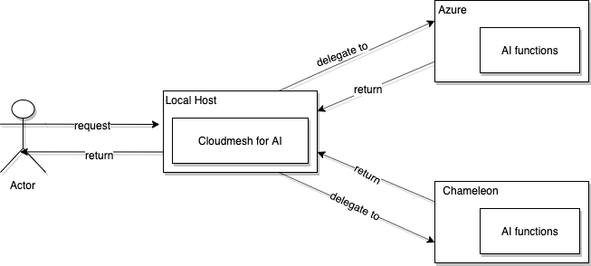

# Cloudmesh Cloud AI Service


[](https://travis-ci.org/TankerHQ/cloudmesn-bar)

[](https://pypi.org/project/cloudmesh-bar)

[](https://pypi.org/project/cloudmesh-bar/)

[](https://github.com/TankerHQ/python-cloudmesh-bar/blob/master/LICENSE)


The cloudmesh Cloud Ai service will provide AI capabilities that are
running on the different cloud, e.g. chamelon, azure. For the example
functions, linear regression, principle components analysis and so on
will be provided so that users can utilize the computing power of the
clouds to train their models. The cloudmesh cloud AI service will
administrate  multiple clouds and determine which cloud to use for
scheduled tasks.

Team Members: 

* [Qiwei Liu, hid 151](https://github.com/cloudmesh-community/fa19-516-151/graphs/contributors), 
* [Yanting Wan, hid 170](https://github.com/cloudmesh-community/fa19-516-151/graphs/contributors)
* Gregor von Laszewski
* Link to the project: <https://github.com/cloudmesh/cloudmesh-analytics>
* Link to the manual: <https://github.com/cloudmesh/cloudmesh-analytics/blob/master/manual.md>

## Instalation

```bash
mkdir cm
cd cm
pip install cloudmesh-installer
cloudmesh-installer git clone cms
cloudmesh-installer install cms

git clone https://github.com/cloudmesh/cloudmesh-analytics.git
cd cloudmesh-analytics


```

or as developer you can simply do 

```bash
mkdir cm
cd cm
pip install cloudmesh-installer
cloudmesh-installer git clone analytics
cloudmesh-installer install analytics
```

## Architecture Design



The architecture primarily contains four objects:

* User which is the actor

* The application running on local host using cloudmesh  will manipulate
  multiple cloud instance, decides delegate computational tasks to which
  cloud

* The AI services will be running on the Azure or chameleon cloud,
  exposing APIs to incoming requests, and return the return the result
  to the local host

## Implementation

### Technologies Used

| Section              | Content                                                      |
| -------------------- | ------------------------------------------------------------ |
| **Operating System** | Mac OS, Ubuntu                                               |
| **OpenAPI**          | The REST API will be defined by using OpenAPI specification  |
| **Swagger editor**   | The swagger editor is used to write API documentation based on the OpenAPI standard |
| **Flask**            | The web application framework that handles incoming requests |
| **Connexion**        | Connexion is an application on the top of Flask that will map the REST API documentation to python functions on Flask |
| **Pytest**           | will be the testing framework                                |

## Progress Report

### Work Breakdown

#### Week 6

[Qiwei Liu](https://github.com/cloudmesh-community/fa19-516-151/graphs/contributors)

1. Set up flask web application framework
2. Set up the test framework and testing data based using sqlite3
3. Done file upload, list file
4. Set up chameleon instance

[Yanting Wan](https://github.com/cloudmesh-community/fa19-516-151/graphs/contributors)

1. Set up connexion, and uses it to map Opean API(yaml) file.
2. Done uploading file locally, testing it on Swagger-ui
3. Done testing a ai function with locally stored dictionary as 
   parameter, testing it on Swagger-ui

#### Week 7

[Qiwei Liu](https://github.com/cloudmesh-community/fa19-516-151/graphs/contributors)

1. Update folder structure
2. Gregor update folder structure, refactor file routes, refacter to analytics route

####  Week 8 

1. Migration to cloudmesh-analytics <https://github.com/cloudmesh/cloudmesh-analytics>

[Yanting Wan](https://github.com/cloudmesh-community/fa19-516-151/graphs/contributors)

1. Download a virtual box to run Ubuntu 19.04 system.
2. Reinstall cloudmesh-cloud, mongoDB in Ubuntu 19.04.
3. Start a VM in Chameleon.
4. Create venv and install requirements in migrated project folder.

- [ ] Problem1: cannot ssh into VM

#### Week 9

[Yanting Wan](https://github.com/cloudmesh/cloudmesh-analytics/graphs/contributors)

1. Write pytest scripts that test the result of kmeans

When writing pytest scripts, come across "Module Not Found Error", to
debug, start a new repository
[yanting-516-partial-project](https://github.com/YantingWan/yanting-516-partial-project/graphs/contributors).

The reasons that cause "Module Not Found Error": The "cloudmesh"
directory in project has namespace conflict with "cloudmesh" directory
in cloudmesh-cloud. Solution: Run command "pip install ." or "python
setup.py install". Then use command "python -m pytest" to run pytest.

####  Week 10

[Yanting Wan](https://github.com/cloudmesh/cloudmesh-analytics/graphs/contributors)

1. Install Docker, run a simple REST service in container
   ([yanting-516-partial-project](https://github.com/YantingWan/yanting-516-partial-project/graphs/contributors))
2. Use cms command to start server in background(from cloudmesh.common.run.background import run)
3. Use cms command to make post/get request (python requests module)
4. Use sphinx-apidoc to generate documentation.

Use docker without typing sudo
```sh
# add docker group
$ sudo group add docker
# add user to docker group
$ sudo gpasswd -a myusername docker
# restart docker
$ sudo service docker restart
$ exit
```

#### Week 11

[Yanting Wan](https://github.com/cloudmesh/cloudmesh-analytics/graphs/contributors)

1. Generate yaml file automatically:

    1. Use post/get decorator to read docstring inside endpoint functions, based on the docstring, output
       orresponding yaml file.
    2. Use jinja module, write a template file, based on the template file, generating corresponding endpoint 
       functions and yaml file.

2. Add code to
[yanting-516-partial-project](https://github.com/YantingWan/yanting-516-partial-project/graphs/contributors)
to use functions in cloudmesh-cloud, then containerlize the project that
requires cloudmesh-cloud.

## Results

### Benchmark 

* [server in localhost](https://github.com/cloudmesh/cloudmesh-analytics/blob/master/tests/linearRegression-local-test.txt)
* [server in azure](https://github.com/cloudmesh/cloudmesh-analytics/blob/master/tests/linearRegression-azure-test.txt)

## References 


* Cloudmesh CMD5 <https://github.com/cloudmesh/cloudmesh.cmd5>
